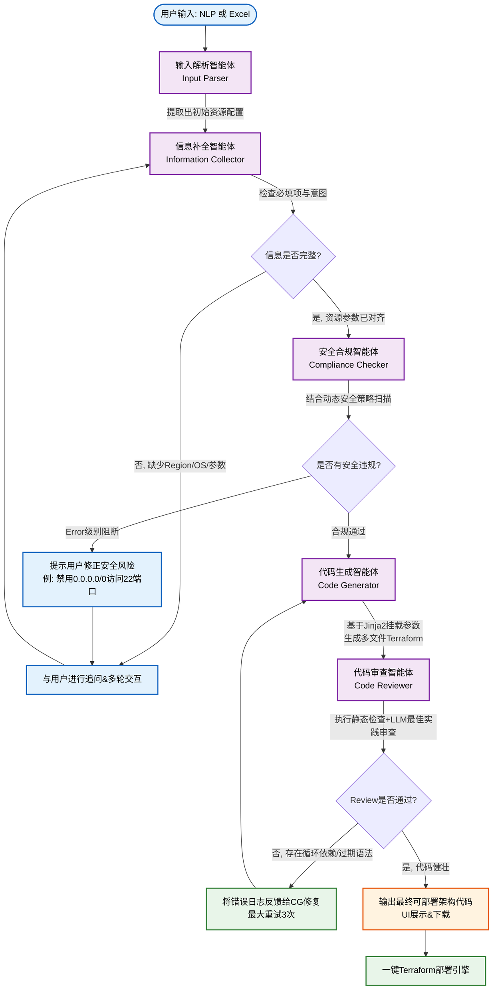

# AI驱动的Cloud IaC代码自动生成工具 (IaC4) - 项目能力与价值白皮书

## 1. 项目概述

**IaC4 (Infrastructure as Code for Cloud)** 是一款先进的、基于智能体（Agentic AI）和大型语言模型（LLM）的云基础设施即代码生成与部署工具。它旨在通过自然语言对话或标准化的Excel模板输入，自动理解用户意图，进行架构设计验证、安全合规检查，并最终生成高质量、可直接执行的 **Terraform代码**（支持 AWS 和 Azure 双云平台）。

该工具不仅仅是一个代码生成器，更是一个融合了**多用户隔离体系**和**多智能体协作架构（Multi-Agent Architecture）**的综合性云运维平台，支持从需求收集到云端自动化部署（Plan & Apply）的全生命周期管理。

---

## 2. 核心功能与能力亮点

### 2.1 企业级多用户与会话管理
- **多端登录认证**：支持本地邮箱密码注册/登录，同时无缝集成了 **Google OAuth** 和 **Microsoft OAuth** 企业级单点登录网关。
- **数据与环境隔离**：每个用户拥有独立的云环境配置（Deployment Environments）、独立的对话Session（ChatSession）和独立的部署历史（Deployments）。用户的云端访问凭证（如AWS Access Key，Azure Client Secret）按用户与环境进行管理。
- **历史记录持久化**：所有的自然语言对话记录、上传的架构Excel、生成的Terraform代码以及基础设施的部署日志（Plan/Apply Output）都被完整持久化，支持随时回溯、复用和审计。

### 2.2 强大的代码生成与双云平台支持
基于预置的 21 种企业级 Jinja2 Terraform 模块化模板，提供开箱即用的优质代码：
- **AWS能力**：全面支持 EC2, VPC, Subnet, Security Group, S3, RDS, NAT Gateway, Internet Gateway, Load Balancer, Target Group, Elastic IP 等核心资源的自动化编排。
- **Azure能力**：全面支持 Virtual Machine, Virtual Network (VNet), Subnet, Network Security Group (NSG), Storage Account, SQL Database, Resource Group, Public IP, NAT Gateway, Load Balancer 等核心组件的自动化编排。并且内置 AzureRM v4.x 版本的严格适配（例如分离 NSG 与 Subnet/NIC 的关联，TDE默认配置规范）。

### 2.3 闭环的自动化部署 (Plan & Apply & Destroy)
- **极简DevOps体验**：用户无需在本地安装配置 Terraform 工具。工具内置执行引擎（Terraform Executor），直接在 Web UI 上一键发起 `terraform plan` 预览变更，二次确认后触发 `terraform apply`。
- **动态资源销毁**：对于临时测试环境，支持一键 `terraform destroy` 安全清理资源。

### 2.4 可视化与实时进度反馈 (SSE Streaming)
- 工具前端 (React19 + Zustand) 通过 Server-Sent Events (SSE) 实时接收后端的 Agent 流式状态。UI会清晰展示每个 Agent 正在执行的具体任务步骤（如"正在分析需求"、"正在合规检查"），提供极佳的人机交互体验。

---

## 3. 核心架构：多智能体协作 (Multi-Agent Architecture)

本项目的先进性最核心体现在其基于 **LangGraph** 构建的有状态多智能体（Stateful Multi-Agent）工作流编排。我们彻底摒弃了单一LLM Prompt的脆弱性，采用"术业有专攻"的 Agent 协作模式。

### 3.1 Multi-Agent 工作流架构图

### 3.2 各 Agent 能力详细描述

#### 1. 输入解析智能体 (Input Parser)
- **职责定位**：大同小异信息的漏斗入口。
- **能力描述**：智能判断用户输入的是预置定义的结构化Excel，还是非结构化的自然语言。对于自然语言，它使用严格的 Few-Shot Context 抽取用户的架构意图（例如"在us-east创建一个带有RDS的VPC网络"），并将其转化为标准化的后端内部对象模型 (`resources` 列表)。对于 "已有资源"(Exists flag) 的识别极为敏锐。

#### 2. 信息补全智能体 (Information Collector)
- **职责定位**：需求调研专家。
- **能力描述**：它掌握所有AWS和Azure云组件的**必需属性**字典（如创建EC2必须有AMI、InstanceType；创建Azure VM必须有Publisher、Offer、SKU的正确UBN组合）。如果Parser传过来的信息缺失（例如用户只说了"帮我建个虚机"），它会主动、礼貌地用用户的原生语言生成追问，引导用户提供Region、操作系统、密码等关键信息。直到资源属性达到100% Ready 才会放行至下一步。

#### 3. 安全合规智能体 (Compliance Checker)
- **职责定位**：DevSecOps 安全架构师。
- **能力描述**：它通过自然语言定义和编辑安全合规规则。在生成代码时，连接后端的持久化策略库（Security Policies）。执行两层拦截：
  - **配置合规扫描**：比如拦截一切高危安全组规则（如暴露了数据库端口到 `0.0.0.0/0`）。
  - **标签合规扫描**：验证资源是否强制包含了企业要求的合规Tags（如 CostCenter, Environment 等）。
  - **阻断机制**：一旦发现致命违规，它会中止流程，将具体的涉险端口或标签反馈给用户，强制要求用户修正需求，真正做到**"安全左移"（Shift-Left Security）**。

#### 4. 代码生成智能体 (Code Generator)
- **职责定位**：资深 Terraform 研发工程师。
- **能力描述**：不同于市面上纯靠 LLM"盲盒"吐出带有幻觉的HCL代码，该Agent结合了 **模板引擎（Jinja2）** 的确定性与 **LLM** 的灵活性。对于核心主干（如网络拓扑建立、虚拟机声明），它通过精准的参数填充渲染标准模板；对于复杂的参数调整及云架构的动态推导，依靠LLM调度。这保证了产出代码100% 符合主流云厂商的官方 Provider 规范。

#### 5. 代码审查智能体 (Code Reviewer)
- **职责定位**：高级架构评审专家 (QA)。
- **能力描述**：对生成的 Terraform 代码进行仿真和沙箱级静态检查。它专门针对版本兼容性排雷（如发现代码使用了 AzureRM 4.0 中被废弃的 `network_security_group_id` 属性参数）。如果发现了潜在的 Provider 冲突或高危硬编码问题，它会直接打回（Reject），附带具体的修复指导意见要求 `Code Generator` 重新生成，最大循环修复三次，确保最终交付给客户的代码可以直接 `terraform init/apply` 而不会报错。

---

## 4. 本项目的技术先进性

1. **从"单体Chat"到"LangGraph编排"的跃升**  
   传统基于LangChain或其他框架的问答型AI很容易陷入上下文丢失和幻觉。本项目采用 **LangGraph 状态机**，在每一步（节点）利用强约束的数据结构传递状态。状态可视化、过程可干预，使得生成极其复杂的云原生架构变得稳定、可预测。

2. **混合驱动：AI的灵活性 + 模板的确定性**  
   使用 LLM 做意图理解、实体抽取、逻辑自修复审查；但是使用成熟的 Jinja2 模块来承担底层 Infrastructure 的声明骨架。完美规避了大型模型在严格缩进语言（如HCL）上的语法生成幻觉。

3. **内置的"自我纠错"（Self-Correction）循环**  
   Code Generator 和 Code Reviewer 之间构成了经典的 Actor-Critic 强化结构。代码不仅是被"生成"出来，更是被内部专家引擎"打磨"出来，具备了类似资深结对编程(Pair-programming)的能力。

4. **双轨输入平滑过度**  
   对于技术人员，支持通过自然语言渐进式设计；对于系统迁移或批量上云，支持提供强约束多Sheet结构的Excel进行1秒解析直达架构代码。

---

## 5. 为云工程师 (Cloud Engineer) 带来的重大核心价值

本工具能够在这几个维度彻底颠覆传统 Cloud Engineer 的工作方式：

### 5.1 生产力实现了 10x 级跃升
传统在 AWS 或 Azure 上手动编写一个包含 VNet, Subnet 集群, NAT Gateway, 及后端挂载 RDS/SQL Database 的高可用虚拟机群的 Terraform 代码，即使是熟手也要耗费数小时查阅官方 API Docs。通过 IaC4，工程师只需上传一张整理好的 Excel，或者和机器人简单对话几句（如："建一个带高可用PG库的AKS集群网络底座"），**数十个 `.tf` 配置文件、变量文件、甚至是 README.md 会在数秒内构建完毕。**

### 5.2 彻底告别"排错地狱" (Debug Hell)
Terraform 中最令人痛苦的往往是模块参数废弃（Deprecation）和循环依赖。比如 AzureRM Provider 的跨大版本升级常常导致历史代码失效。
通过内部的 **代码审查智能体** 执行静态规则过滤与合规扫描，工程师直接获得的是与当前各大厂云 API 最新版本同步的高质量代码，消灭了 "Apply阶段才报错" 的挫败感。

### 5.3 默认即安全的防御阵线 (Secure by Default)
云安全事故 90% 源于工程师手误配错了安全组 (Security Group) 或没开启云存储 (S3/Blob) 强加密。
本工具的 **合规检查智能体** 在设计阶段（即代码未生成前）就结合企业自定义库进行了阻拦扫描，充当了7x24小时全天候不知疲倦的安全架构审核员，确保经由该系统分发的每一套云基础设施都不会存在"门洞大开"的公网暴露。

### 5.4 零心智负担的集成式部署体系
工程师再也不用打开 Terminal，纠结本地 Terraform 版本不对，或是本地没有配置环境变量。在 Web 界面上就可以利用一键 Plan 预览爆炸半径，点击 Apply 即可通过后端执行引擎安全推送上云。甚至对于不同的租户和开发/测试环境，可以在界面上任意切换部署上下文，大幅降低 DevOps 认知负担。

### 总结
IaC4 平台将 Cloud Engineer 从枯燥的 HCL 语法查阅、繁难的参数联调和枯燥的安全 Checklists 中解脱出来。赋予工程师一个拥有"领域专家"级别知识的 AI 同事，让他们能将精力完全聚焦在**高价值的应用架构设计与业务交付**上。
